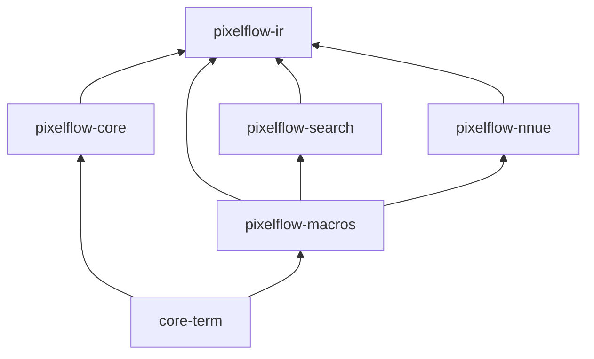

# Compiler Architecture 2026: Unifying the IR

## 1. The Problem
We currently suffer from the **"Triple IR" problem**:
1.  `pixelflow-macros`: Has a Syn-based AST.
2.  `pixelflow-search`: Has `ExprTree` and `Op` traits.
3.  `pixelflow-nnue`: Has `Expr` and `OpType` enums.

Additionally, `pixelflow-core` implicitly defines the "Target ISA" via its `SimdOps` traits, but this definition is disconnected from the symbolic IRs. Adding a new operation (e.g., `sinh`) requires manual updates across 4+ crates, making the system brittle.

## 2. The Solution: `pixelflow-ir` as the Foundation

We will consolidate the **Abstract Definition** (Op Enums) and the **Concrete Execution** (SIMD Backends) into a single foundational crate: `pixelflow-ir`.

### 2.1 Dependency Graph

### 2.2 Crate Responsibilities

#### `pixelflow-ir` (The Virtual Machine)
*   **Role**: Defines the Instruction Set Architecture (ISA) and its implementation.
*   **Contents**:
    *   **Data**: `OpType` (Canonical Enum), `Expr` (AST), `HalfEPFeature`.
    *   **Execution**: `trait SimdOps`, `trait Backend`.
    *   **Implementations**: `struct Avx512`, `struct Neon`, `struct Wasm`.
*   **Why**: By putting the Backend here, we establish that the *IR Operations* map 1:1 to *Backend Primitives*.

#### `pixelflow-core` (The Standard Library)
*   **Role**: User-facing API and high-level combinators.
*   **Contents**:
    *   `struct Field<B: Backend>`: Wraps `B::F32`.
    *   `trait Manifold`: User abstraction.
    *   `ops/`: Helper functions calling `Field` ops (which call `ir::SimdOps`).
    *   **Change**: No longer defines SIMD backends; imports them from `ir`.

#### `pixelflow-search` (The Optimizer)
*   **Role**: Symbolic optimization.
*   **Contents**: E-Graph engine, Rewrite Rules, Cost Model.
*   **Change**: Uses `ir::Expr` and `ir::OpType` instead of defining its own.

#### `pixelflow-nnue` (The Brain)
*   **Role**: Heuristic evaluation.
*   **Contents**: Neural Network weights, Inference logic.
*   **Change**: Uses `ir::HalfEPFeature` and `ir::OpType`.

### 2.3 Specific Component Placement

| Component | Location | Reasoning |
| :--- | :--- | :--- |
| **Dual Numbers (Jets)** | `pixelflow-core` | High-level math abstraction built *on top* of `Field`. Depends on `Field` ops. |
| **Manifold Trait** | `pixelflow-core` | User-facing abstraction for "something that can be evaluated". |
| **Discrete (Integer)** | `pixelflow-core` | User wrapper around `ir::Backend::U32`. |
| **Sequential Loading** | `pixelflow-ir` (Impl)   `pixelflow-core` (API) | `SimdOps::sequential()` or `vld1q` goes in `ir` (backend intrinsic). `SequentialField` wrapper goes in `core`. |
| **Lifting** | `pixelflow-core` | Traits like `From<f32>` for `Field` or `From<Field>` for `Jet`. |

---

## 3. Migration Plan

### Phase 1: Establish `pixelflow-ir`
1.  [x] Create `pixelflow-ir` crate.
2.  [x] Move `OpType`, `Expr`, `HalfEPFeature` from `search` to `ir`.
3.  [ ] **Move Backends**: Transfer `pixelflow-core/src/backend/` to `pixelflow-ir/src/backend/`.
    *   Depend on `libm` in `ir`.
    *   Expose `SimdOps`, `Backend`, `F32x4` etc. publicly.

### Phase 2: Refactor `pixelflow-core`
1.  Add dependency on `pixelflow-ir`.
2.  Delete local `src/backend/`.
3.  Re-export `pixelflow_ir::backend::*` as `pixelflow_core::backend`.
4.  Update `Field` to wrap `pixelflow_ir::backend::SimdOps`.

### Phase 3: Consolidate ML Stack
1.  Update `pixelflow-search` to use `pixelflow_ir::Expr`.
2.  Update `pixelflow-nnue` to use `pixelflow_ir::OpType`.
3.  Delete duplicate definitions in `pixelflow-ml`, `search`, `nnue`.

## 4. "Adding a New Op" Workflow (Post-Refactor)

To add `Sinh`:
1.  **`pixelflow-ir`**:
    *   Add `OpType::Sinh`.
    *   Add `fn sinh()` to `SimdOps` trait.
    *   Implement `sinh()` in backends (Avx, Neon, etc.).
2.  **`pixelflow-core`**:
    *   Add `Field::sinh()` calling `self.0.sinh()`.
3.  **`pixelflow-macros`**:
    *   Map `sinh` token to `ir::Expr::Unary(OpType::Sinh, ...)`.

**Result**: Strong compiler enforcement. If you add it to `OpType`, you must implement it in the Backend (trait obligation), and the Optimizer/NNUE immediately know about it (shared Enum).
